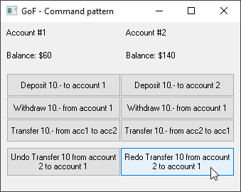

# OOP_Command  
## GoF command pattern  
Have you ever wondered how to implement the Undo/Redo functionality?  
Here is a very powerful and useful implementation of Undo/Redo by using the command pattern.   
project started in aug. 2015  

